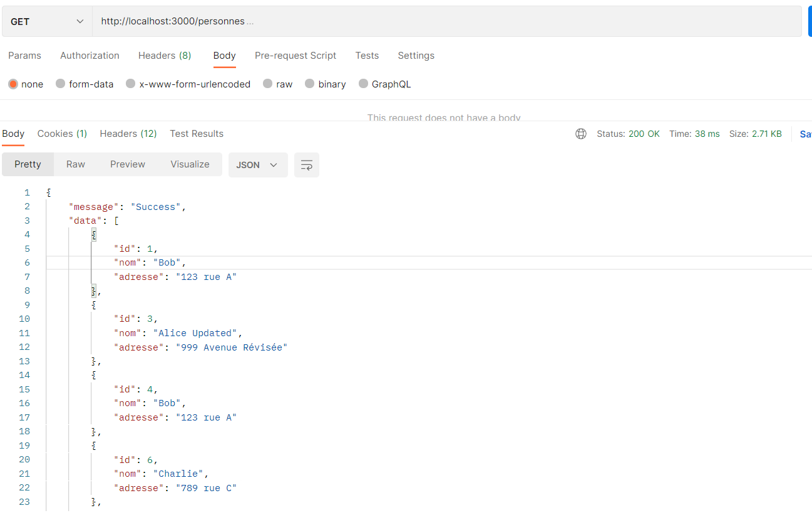
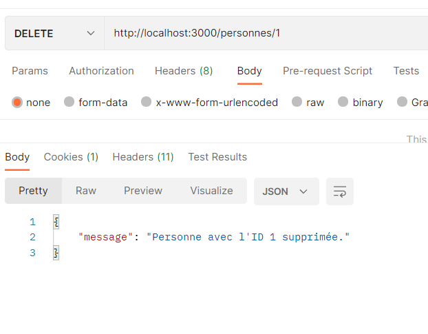

# tp2 Aymen Mabrouk

## Description

This project is a simple REST API for managing a registry of people. It uses Node.js with Express for the server, SQLite for the database, and Keycloak for authentication.

## Installation

1. Clone the repository:

   ```sh
   git clone https://github.com/yourusername/tp2.git
   cd tp2
   ```

2. Install dependencies:

   ```sh
   npm install
   ```

3. Ensure SQLite is installed on your system.

4. Configure Keycloak:
   - Update the `keycloak-config.json` file with your Keycloak settings.

## Usage

1. Start the server:

   ```sh
   node index.js
   ```

2. The server will be running on `http://localhost:3000`.

## API Endpoints

### GET /personnes

Retrieve all people.

```sh
curl http://localhost:3000/personnes
```



### GET /personnes/:id

Retrieve a person by ID.

```sh
curl http://localhost:3000/personnes/1
```


### POST /personnes

Create a new person.

```sh
curl -X POST -H "Content-Type: application/json" -d '{"nom": "John Doe", "adresse": "123 Main St"}' http://localhost:3000/personnes
```

### PUT /personnes/:id

Update a person by ID.

```sh
curl -X PUT -H "Content-Type: application/json" -d '{"nom": "Jane Doe", "adresse": "456 Elm St"}' http://localhost:3000/personnes/1
```

### DELETE /personnes/:id

Delete a person by ID.

```sh
curl -X DELETE http://localhost:3000/personnes/1
```



### GET /secure

Access a secure endpoint (requires authentication).

```sh
curl http://localhost:3000/secure
```
